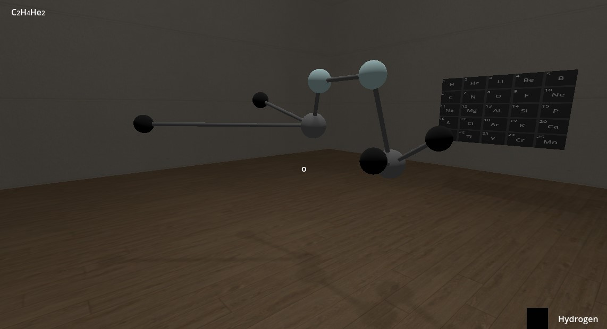
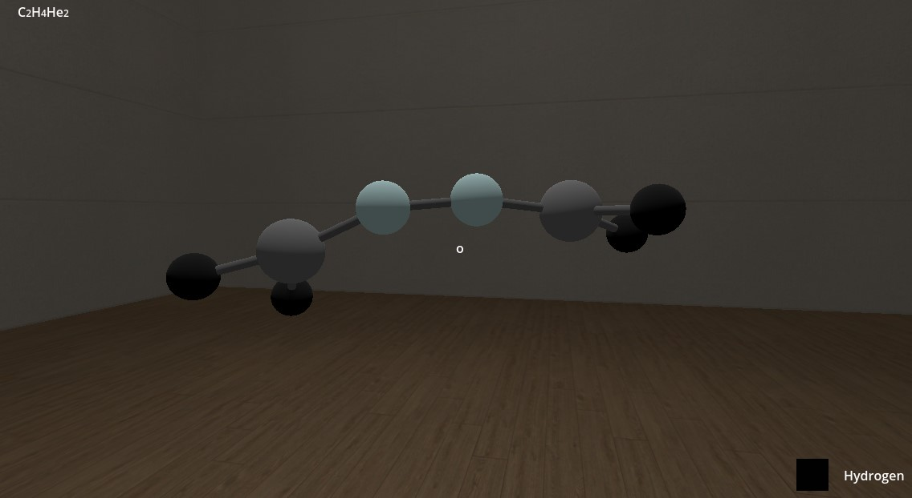
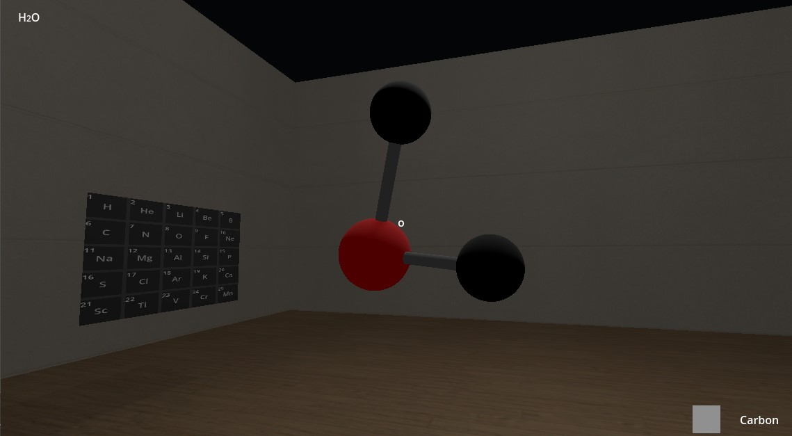
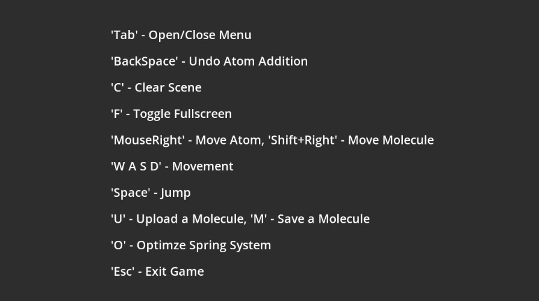

# Molecular Design Simulator

## Overview

This project is a **Molecular Design Simulator** developed using **Godot 4** and **C#**. The application allows users to design molecular structures by dynamically placing atoms within a 3D environment and generating bonds between them. It also features a spring system optimization to minimize the molecular geometry, ensuring realistic and stable configurations.

Additionally, the simulator supports saving and loading molecular structures using the Z-Matrix format. This project is designed with the potential to expand into Virtual Reality (VR).

## Features

- **Dynamic Atom Placement:** Easily place atoms in a 3D space using an intuitive user interface.
- **Bond Generation:** Automatically generate and visualize bonds between atoms based on a drag-and-drop system.



- **Spring System Optimization:** Optimize the molecular geometry using a spring system that minimizes energy and stabilizes the structure.



- **Z-Matrix File Support:** Save and load molecular structures using the Z-Matrix format, a common format for molecular modeling.

H2O Molecule uploaded from the following Z-Matrix:
```
O
H 1 0.96
H 1 0.96 2 104.5
```



- **Periodic Table 3D UI:** While incomplete, we included an interactive periodic table for selecting elements to place in the scene.

- **Full 3D Visualization:** Visualize atoms and bonds in a 3D environment, with real-time updates and adjustments.

## Getting Started

### Prerequisites

- **Godot Engine 4.x**: Download and install from the [official Godot website](https://godotengine.org/).
- **C# Support**: Ensure C# support is enabled in Godot.
- **.NET SDK**: Install the .NET SDK compatible with Godot 4.x.

### Installation

1. **Clone the Repository**:
   ```bash
   git clone https://github.com/alaa-khamis/molecular_design_simulator.git
   cd molecular_design_simulator
   ```

2. **Open in Godot**:
   - Launch Godot and import the project folder.
   - Godot will automatically import the project files and setup the environment for developement.

3. **Run the Project**:
   - Click the **Play** button in Godot to start the simulator.

### Controls



## Future Work

- **VR Integration**: Expand the simulator to support Virtual Reality for a more immersive experience.

